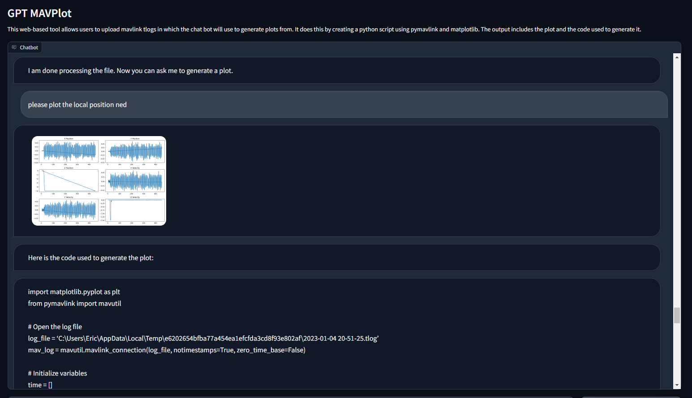
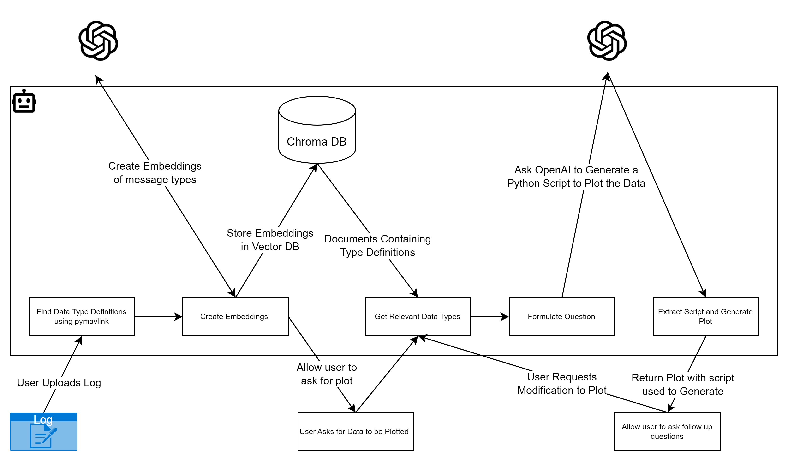

# GPT_MAVPlot

MAVPlot is a Python-based project which uses Gradio as an interface and GPT-X powered by OpenAI as a chatbot to generate and plot MAVLink data. It provides an easy-to-use, chatbot-like interface for users to describe the plot they would like to generate.

Demo is available at: https://huggingface.co/spaces/ericjohnson97/gpt_mavplot



## Architecture



## Installation

Clone the repository:

```shell
git clone https://github.com/yourusername/mavplot.git
```

Setup Python Virtual Environment:

```shell
python3 -m venv .venv
```

Activate the virtual environment:

```shell
source .venv/bin/activate
```


Install the requirements:

```shell
pip install -r requirements.txt
```

Setup .env File 

Copy the `template.env` file to a file named `.env` in your root directory. Add your Openai API key to the file  

## Usage

After installing all dependencies, run the main script using:

```shell
python app.py
```

A web-based Gradio interface will launch. You can upload a mavlink tlog then prompt the bot to generate plots from the log. The chatbot will process your request and generate the corresponding plot, which will be displayed in the chat interface. The script use to generate the log will also be posted to the chat interface. 

## Contributing

Pull requests are welcome. For major changes, please open an issue first to discuss what you would like to change. Please make sure to update tests as appropriate.

## License

[MIT](https://choosealicense.com/licenses/mit/)


## Lessons Learned (So Far)

- At first I hoped that I could simply engineer a prompt to generate plots of the logs. This worked about 50 percent of the time or less. It seems that bot gpt 3.5 and 4 (which I also tested with) do not have enough knowledge of the exact MAVLink messages to reliably generate the plots. To combat this I added the preprocessing step. This parses the log and finds all the unique message structures. From there they are embedded and stored in a chromaDB vector database. Possibly relevant message structures are recalled from the prompt the user provides and passed to the query to OpenAI. This seems to work very reliably for me. 
